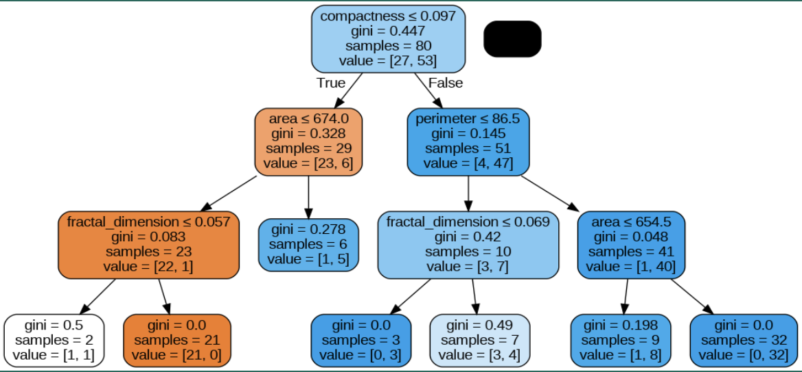

# Prostate Cancer Detection

## Introduction

Ever since ML became a buzzword, cancer diagnosis using machine learning models has been a goal of young, beginning data analysts. Not only is it a task with high applicability in the medical field, it would also be a task perfect for applying all the skills we’ve developed during this course. As a binary classification task, we would be able to apply many different techniques and have a final comparison of the models we’ve learned in this course.

## Problem Definition

We are looking to predict whether a prostate has cancer or if it is benign. We will mainly be using a Prostate Cancer Dataset of 100 patients about appearance and texture as features for this prediction.
This is a supervised learning binary classification task since we are trying to find out if it is benign or malignant. The expected inputs are a set of values for the 8 numerical features (Radius, Texture, Perimeter, Area, Smoothness, Compactness, Symmetry, Fractal Dimension). The predicted Diagnosis is encoded as 0 or 1 based on the training model.

## Datasets

### Description

We used [Sajid Saifi’s Prostate Cancer](https://www.kaggle.com/datasets/sajidsaifi/prostate-cancer) dataset hosted on Kaggle. This was a relatively small dataset consisting of 100 data points, corresponding to 100 unique prostate cancer cysts found on real cancer patients. It had a total of 9 features, with most being physical measurements related to the cyst:

- ID – categorical, unique identifier for each data point
- Radius – numerical, of the cyst
- Texture – numerical, of the cyst
- Perimeter – numerical, of the cyst
- Area – numerical, of the cyst
- Smoothness – numerical, of the cyst
- Compactness – numerical, of the cyst
- Symmetry – numerical, of the cyst
- Fractal Dimension – numerical, of the cyst
- Diagnosis – categorical, Benign (B) or Malignant (M)

### Preprocessing

Because ID is simply a categorical variable assigned arbitrarily to a given cyst, we decided it likely would have little predictive capability for whether the cyst was benign or malignant and removed it from the feature set.

No feature values were missing from any of our data points, so we did not need to perform any imputation. However, our preprocessing pipeline does have an imputation stage (using the median value of a feature for filling in missing values) in the case that any additional data is missing feature values.

To help our models digest our data, we performed standardization on all of our numerical features.

Finally, because our models output numerical values corresponding to the final diagnosis of a cyst, we needed to encode the diagnosis values as 0 and 1 for benign and malignant diagnoses, respectively.

## Experiments

For our project, we mainly used four different algorithms: linear regression, logistic regression, support vector machine, and a decision tree/random forest.

**Linear Regression:**

- No Regularization:
  - MSE: 0.1318
  - Accuracy: 0.867
- Lasso Regularization:
  - MSE: 0.1256
  - Accuracy: 0.933
- With Ridge Regularization:
  - MSE: 0.1238
  - Accuracy: 0.967
- With Ridge Classifier: - MSE: 0.0333 - Accuracy: 0.967

Regarding linear regression, linear regression with a ridge classifier performed the best.

**Logistic Regression:**

- No Regularization:
  - MSE: 0.1333
  - Accuracy: 0.917
- L1 Regularization:
  - MSE: 0.0667
  - Accuracy: 0.933
- L2 Regularization:
  - MSE: 0.0333
  - Accuracy: 0.967
- Elasticnet Regularization:
  - MSE: 0.033
  - Accuracy: 0.967

Regarding logistic regression, logistic regression performed best with L2 and Elasticnet regularization.

**Support Vector Machine:**

- Optimal Hyperparameters:
  - Regularization: 1000
  - Kernel: Linear
  - Kernel Coefficient: 0.0001
- MSE: 0.067
- Accuracy: 0.933

**Decision Tree/Random Forest:**

- 
- Accuracy: 0.8

Ultimately, the optimized decision tree was the most interpretable, with a clear visual representation and low likelihood of overfitting, and the logistic models performed the best, perhaps in part due to overfitting.

## Future Work

The dataset used for our project was a bit smaller than we would have preferred it to be, so future work would begin with finding more data and preprocessing it to be compatible with our current dataset.

It could be interesting to create more visualizations of our data; for example, comparing the performance of different models on one graph using some of the 3D visualization method we learned, or looking for correlations between any features. In particular, I think it would have been very useful to look for correlations, as they could serve as easier ways to inform potential patients that they might want to get a diagnosis if they notice something.

Another future idea that we could have implemented given more time could be looking at the coefficients given by the linear models to determine which features might be more important than others, and perhaps see if LASSO regression zeroed out any features.
